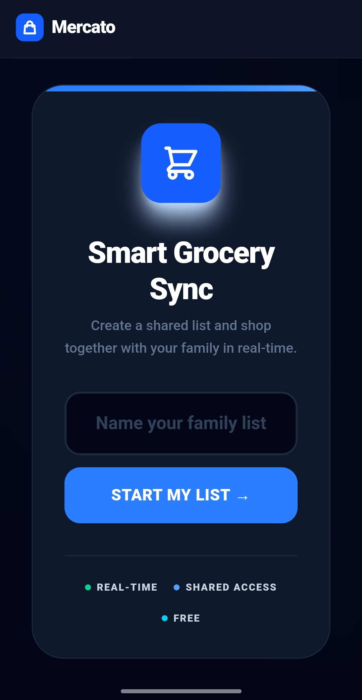
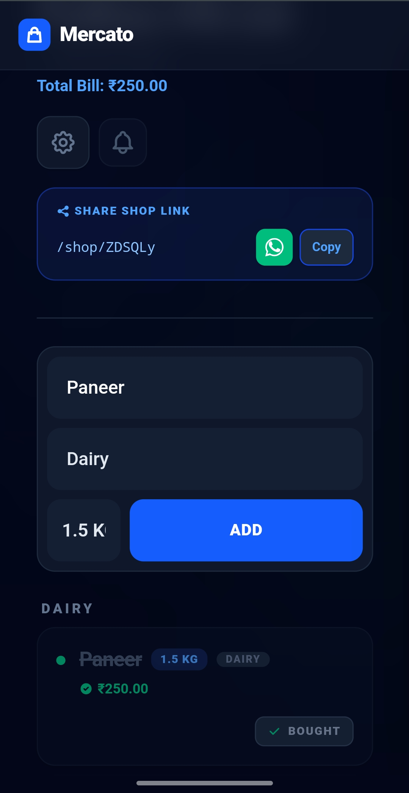
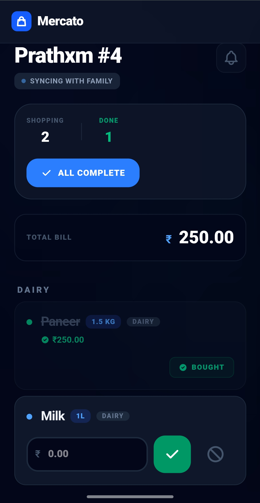

# Mercato 🛒

[](https://goreportcard.com/report/github.com/PrathxmOp/Mercato)
[](https://github.com/PrathxmOp/Mercato/releases)
[](https://github.com/PrathxmOp/Mercato/actions/workflows/ci.yml)
[](https://opensource.org/licenses/MIT)

Mercato is a modern, real-time shopping list application designed for families and small groups. It features a sleek mobile-first UI, categorized item grouping, and a real-time chat system for coordination.

## Visual Showcase 📸

| Home Screen | Shared List | Mobile Shop |
| :---: | :---: | :---: |
|  |  |  |

## Features ✨

- **Real-time Sync**: Items and chat messages update instantly across all devices via WebSockets.
- **Item Categories**: Organize your list by aisle or category (Dairy, Produce, Pantry, etc.) for efficient shopping.
- **Internationalization**: Full i18n support via JSON locale files, ready for Weblate integration.
- **Multi-currency**: Dynamic currency selection (INR, USD, EUR, GBP) that updates in real-time.
- **Mobile First**: Responsive design that looks premium on any device.
- **Refined UX**: Premium dark mode support and polished home screen aesthetics.

## Quick Start 🚀

### Binary (Easiest)

1. Download the latest binary for your OS from the [Releases](https://github.com/PrathxmOp/Mercato/releases) page.
2. Grant execution permissions: `chmod +x mercato_Linux_x86_64` (on Linux/macOS).
3. Run it: `./mercato_Linux_x86_64`

The application will be available at `http://localhost:8082`.

### Using Docker

```bash
docker-compose up --build
```

The application will be available at `http://localhost:8082`.

### Manual Setup

1. **Prerequisites**:
   - Go 1.25.5 or later
   - [Templ](https://templ.guide) CLI

2. **Generate Templates**:
   ```bash
   templ generate
   ```

3. **Build & Run**:
   ```bash
   go build -o bin/mercato ./cmd/mercato/main.go
   ./bin/mercato
   ```

## Tech Stack 🛠️

- **Backend**: Go (Golang)
- **Frontend**: Templ, HTMX, Tailwind CSS
- **Database**: SQLite
- **Communication**: WebSockets (Gorilla)
- **i18n**: JSON-based translation system

## Internationalization (i18n) 🌍

Mercato supports multiple languages. Translation files are located in the `locales/` directory.

- `locales/en.json`: English (Base)
- To add a new language, create a `{lang_code}.json` file in the same directory. The application automatically detects the user's language via the `Accept-Language` header.

## License 📄

This project is licensed under the MIT License - see the [LICENSE](LICENSE) file for details.
